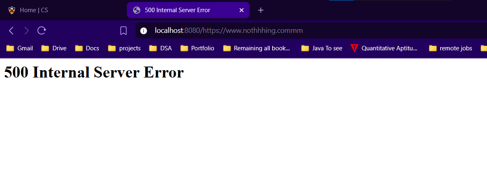

.h files are for, declaring things.

Parsed request represents an HTTP request
                                            Parsed request <=> HTTP request
    contains method : GET,POST,PUT 
    protocol: HTTP,
    host,
    port,

many more about header and about the link

Parsed Header: key value pair

Cache : will be of lru, least recently used things will be thrown out, if Cache has no space..

See If two threads are created one accessing google.com, other accessing facebook.com so both try to put in shared resource then race condition may occur.
So need to handle with semaphores.     

generally proxy server will be listening on one socket only, if a client comes and requests connections opens, a new socket and gets connected to that new socket.
so the original first socket will always be on listening mode.  

ntop: network understandableip to presentation format ip.
htons: port conversion of human understandable to network understandable.

Here semaphores actually controls the number of clients being served concurrently  
sem_wait(): this decreases the value of the variable
sem_post(): this increases the value of the variable
so if value goes below 0 , then the client needs to wait.

